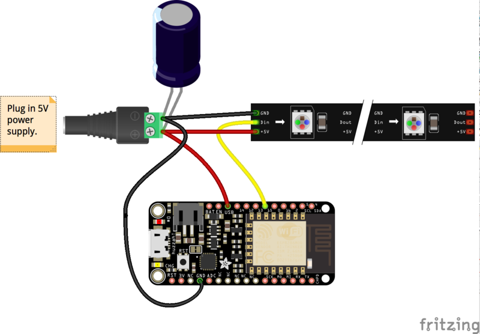

= no-hell-lights

Having fun with lights and micro-controllers.

== Led Strips

=== Material

WS2812 comes in 5v or 12v.

[WARNING]
====
12v are hooked 3 by 3, which means that programmatically there are 3 times less leds.
====

Each led consumes 0.2W max, to be safe count 20W for 60 led, that is 20W per meter.

I use 5v 150W power supply so that 10m 600 led strip is fine.

==== Wiring

Using Arduino Pro Mini 5v as reference.

Wiring for ESP8266 or ESP32 is same as stated below.

As stated in NeoPixel library:

[IMPORTANT]
====
To reduce NeoPixel burnout risk, add 1000 uF capacitor across
pixel power leads, add 300 - 500 Ohm resistor on first pixel's data input
and minimize distance between Arduino and first pixel.  Avoid connecting
on a live circuit...if you must, connect GND first.
====

Then just hook up data pin to one of the pin of arduino.

[NOTE]
====
For 12v strips, make sure not to burn the arduino 5v: don't hook the Vcc !
====

==== Sketches

External samples:

* https://github.com/FastLED/FastLED/blob/master/examples/DemoReel100/DemoReel100.ino[Very Good example]

Internal samples:

* link:sketches/arduino/WS2812/Fast-LED-sample1/Fast-LED-sample1.ino[Fast-LED-sample1.ino]

==== Resources

* https://arduino-esp8266.readthedocs.io/en/latest/

* https://github.com/FastLED/FastLED
* https://github.com/adafruit/Adafruit_NeoPixel[Adafruit_NeoPixel]
* https://www.tweaking4all.com/hardware/arduino/adruino-led-strip-effects/[Examples]

* LUSTREON 50CM Aluminum Channel Holder For LED Strip Light Bar Under Cabinet Lamp

* https://www.instructables.com/id/Wireless-Music-Reactive-Floor-Lamps
* https://github.com/hansjny/Natural-Nerd/tree/master/SoundReactive2
