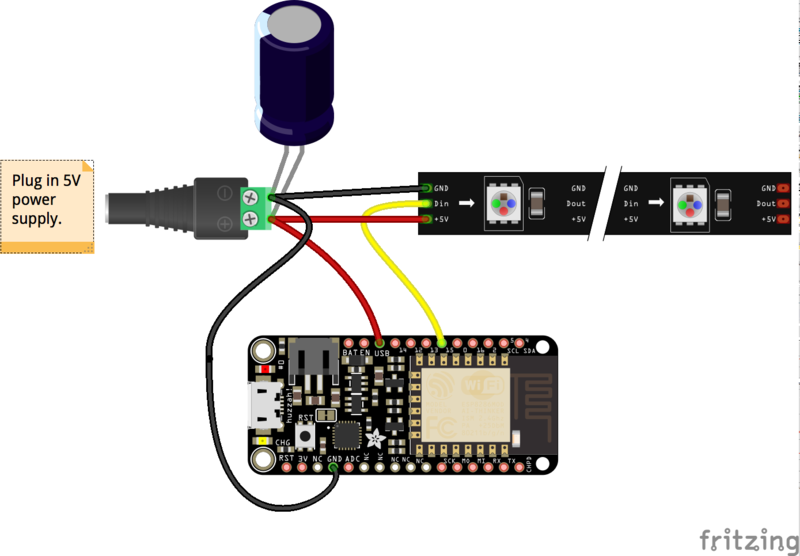

= no-hell-lights

*"No Hell"* pronounces like *"Noël"* in French, meaning *"Christmas"* lights.

While this project looks focused on interacting with LED lights, this repository is also a fun way to touch on the below technology:

- Electronic (with very little soldering)
- Arduino IDE coding (C-like) using ESP8266 supporting Wifi
- REST API Designs
- Web-sockets programming
- Web UI - TBD: VueJS UI ?
- Open CV for a little of Machine Learning tools - TBD
- Android - TBD

In short, this repository demonstrate all above topics are "no hell".

== Led Strips

=== Material

* WS2812b comes in 5v or 12v.

[WARNING]
====
12v are hooked 3 by 3, which means that programmatically there are 3 times less leds.
====

Each led consumes 0.2W max, to be safe count 20W for 60 led, that is 20W per meter.

I use 5v 150W power supply so that 10m 600 led strip is fine.

* WS2815 is enhancement of WS2812b (12v with individual address, and with sustain led failure)

* SK6812 is 5v, and has a 4th channel for white light, available in cold or warm white

==== Wiring

Using Arduino Pro Mini 5v as reference.

Wiring for ESP8266 or ESP32 is same as stated below.

As stated in NeoPixel library:

[IMPORTANT]
====
To reduce NeoPixel burnout risk, add 1000 uF capacitor across
pixel power leads, add 300 - 500 Ohm resistor on first pixel's data input
and minimize distance between Arduino and first pixel.  Avoid connecting
on a live circuit...if you must, connect GND first.
====

Then just hook up data pin to one of the pin of arduino.

[NOTE]
====
For 12v strips, make sure not to burn the arduino 5v: don't hook the Vcc !
====

=== Board

Details of board can be found under link:boards[]

=== Sketches

External samples:

* https://github.com/FastLED/FastLED/blob/master/examples/DemoReel100/DemoReel100.ino[Very Good example]

Internal samples:

* link:sketches/arduino/WS2812/Fast-LED-sample1/Fast-LED-sample1.ino[Fast-LED-sample1.ino]

=== APIs

==== Status

[source,bash]
----
$ curl --request GET http://192.168.1.50/status

{
 "system": {
   "heap": 36944,
   "boot-version": 5,
   "cpu-frequency": 160,
   "sdk": "1.5.3(aec24ac9)",
   "chip-id": 2918146,
   "flash-id": 1458400,
   "flash-size": 4194304,
   "vcc": 65535,
   "gpio": 86053
  },
 "message": "status",
 "properties": {
   "power": 1,
   "animation-mode": "single",
   "brightness": 255,
   "autoplay-duration": 10
  },
 "effects": [
   { "id": 0, "name": "RGB Loop" },
   { "id": 1, "name": "Juggle" },
   { "id": 2, "name": "BPM" },
   { "id": 3, "name": "Sinelon" },
   { "id": 4, "name": "Bouncing Balls" },
   { "id": 5, "name": "Bouncing Balls Multiple" },
   { "id": 6, "name": "Candle" },
   { "id": 7, "name": "Fade-in Fade-out" },
   { "id": 8, "name": "Strobe" },
   { "id": 9, "name": "Halloween Eyes" },
   { "id": 10, "name": "Cylon Bounce" },
   { "id": 11, "name": "New KITT" },
   { "id": 12, "name": "Twinkle" },
   { "id": 13, "name": "Twinkle Random" },
   { "id": 14, "name": "Sparkle" },
   { "id": 15, "name": "Sparkle Snow" },
   { "id": 16, "name": "Running Lights" },
   { "id": 17, "name": "Color Wipe" },
   { "id": 18, "name": "Rainbow Cycle" },
   { "id": 19, "name": "Theater Chase" },
   { "id": 20, "name": "Theater Chase Rainbow" },
   { "id": 21, "name": "Meteor Rain", "selected":true },
   { "id": 22, "name": "Fire" },
   { "id": 23, "name": "Confetti" }
  ]
}
----

==== Settings

Sets some settings.
Can be one of:

* animation-mode= autoplay/single/paint

[source,bash]
----
$ curl --request POST  http://192.168.1.50/settings?animation-mode=single
----

==== Set Pixels

[source,bash]
----
$ curl --request POST --data '{ "pixels": [ { "index":1, "color": 0x123456 }, { "index": 2, "color": 0x987654 } ] }' http://192.168.1.50/pixels/set
{
  "pixels": [
    {
      "index": 1,
      "color": 0x123456
    },
    {
      "index": 2,
      "color": 0x987654
    }
  ]
}
----

==== Reset Pixels

Rest to a given color, for example to white.

[source,bash]
----
$ curl --request POST http://192.168.1.50/pixels/reset?color=0xFFFFFF
----

=== REST Python codes

* link:src/rest-animation-01.py[Sinelon]

* link:src/rest-animation-02.py[Strobe]

* link:src/rest-animation-03.py[Fade-In Fade-Out]

* link:src/rest-animation-04.py[Fade-Out Random Color]

* link:src/rest-animation-05.py[Fading Sinelon]

* link:src/rest-animation-06.py[Twinkle Random]

== Resources

* link:https://arduino-esp8266.readthedocs.io/en/latest/[]
* link:https://github.com/FastLED/FastLED[]
* link:https://github.com/adafruit/Adafruit_NeoPixel[Adafruit_NeoPixel]
* link:https://www.tweaking4all.com/hardware/arduino/adruino-led-strip-effects/[Examples]
* LUSTREON 50CM Aluminum Channel Holder For LED Strip Light Bar Under Cabinet Lamp
* link:https://github.com/hansjny/Natural-Nerd/tree/master/SoundReactive2[]
* link:https://opencv.org/platforms/android/[]

Fun projects:

* link:https://www.instructables.com/id/Wireless-Music-Reactive-Floor-Lamps[Fun project]
* link:https://www.instructables.com/id/Christmas-LED-Sphere/[Fun project]
* link:https://www.instructables.com/id/Super-Simple-RGB-WiFi-Lamp[Fun project]
* Matrix:
** link:https://github.com/AaronLiddiment/LEDMatrix[LED Matrix]
** link:https://github.com/AaronLiddiment/LEDText[LED Text]